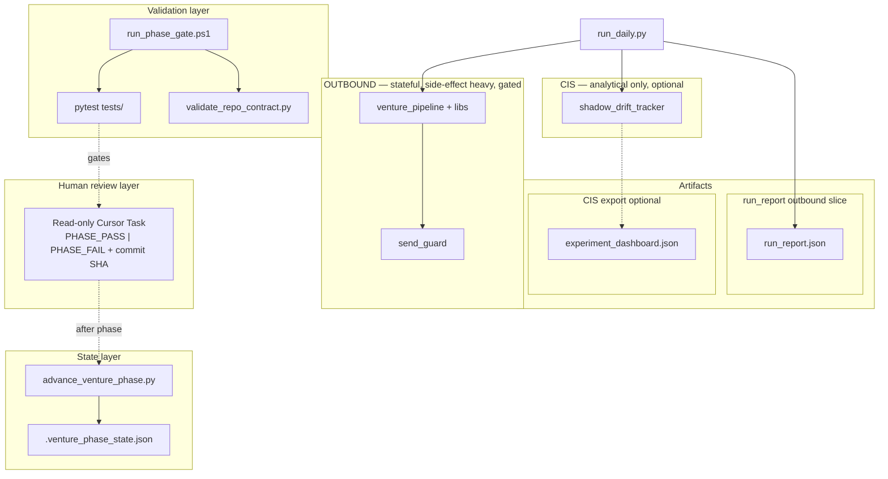

# Venture OS — system model & invariants (one page)

> **Governance:** This page is a **cognitive map only**. It is **not authoritative for implementation correctness** (diagrams can drift). **Sources of truth for behavior:** `run_report_schema.py`, `validate_repo_contract.py`, `pytest`, and procedure locks in **`AGENTS.md`** plus **`VENTURE_OS_VFINAL_1_EXECUTION_PLAN.md`** / **`VENTURE_OS_P3_P6_AUTONOMOUS_EXECUTION_PLAN.md`**. If anything here disagrees with those, **they win**.

Canonical pointers: **`AGENTS.md`**, **`VENTURE_OS_VFINAL_1_EXECUTION_PLAN.md`**, **`VENTURE_OS_P3_P6_AUTONOMOUS_EXECUTION_PLAN.md`**.

---

## Architecture (layers)



**Truth ordering:** `run_daily` → **`run_report.json`** (machine truth) → CLI line + optional dashboard (views only).

---

## Invariants (must not regress)

| ID | Invariant |
|----|-----------|
| E1 | **Single canonical user CLI** for coordinated daily runs: `run_daily.py` (other CLIs gated or allowlisted). |
| E2 | **One atomic `run_report.json` per run**; schema = **`run_report_schema.py`** only; CI checks `RunReport.model_fields` keys match contract. |
| E3 | **Dual namespace (asymmetric):** `outbound` (money path, gated) and `cis_eval` (analysis only, optional) are siblings **in one report file** — **not** one lifecycle, **not** one risk profile; CIS must not import outbound modules. |
| E4 | **Resend outbound POST path** substring (`api.resend.com` + `/emails` contiguous) appears **only** in `send_guard.py` (CI rglob + doc must not embed that substring outside `send_guard`). |
| E5 | **Money path:** policy / creds / `send_guard` ordering and dry-run semantics per **`tests/test_money_path_gates.py`**; no live Resend without guard path. |
| E6 | **`VENTURE_DEV_MAIN=1`** required for direct `venture_pipeline` / `run_pipeline` / `shadow_drift_tracker` `__main__` (except `venture_pipeline --status`). |
| E7 | **Phase FSM:** `04-coding/.venture_phase_state.json` exists and validates; transitions **P3→P6** only via **`advance_venture_phase.py`** (bounded writer). |
| E8 | **Reviewer I/O:** read-only Task; first line **`PHASE_PASS: Pn`** or **`PHASE_FAIL: Pn`**; commit SHA recorded (see P3–P6 plan). |

---

## Deterministic gates (commands)

```text
pytest tests -q
python 04-coding/scripts/validate_repo_contract.py
powershell -File 04-coding/scripts/run_phase_gate.ps1 [-ExpectCurrentPhase P3]
```

After **`PHASE_PASS: Pn`:** `python 04-coding/scripts/advance_venture_phase.py Pn` then commit **`.venture_phase_state.json`**.

---

## Known non-goals (by design)

- Reviewer is **not** deterministic code; **CI + gates** are.
- **Manual** advance after pass is intentional (avoids auto-mutating repo state); optional later: CI detects PASS artifact and runs `advance_venture_phase.py` or warns on drift (`last_review_commit` vs `current_phase`).

---

## File map (minimal)

| Concern | Path |
|---------|------|
| Orchestrator | `04-coding/scripts/run_daily.py` |
| Report schema | `04-coding/scripts/run_report_schema.py` |
| Report I/O | `04-coding/scripts/run_report_writer.py` |
| Repo contract CI | `04-coding/scripts/validate_repo_contract.py` |
| Phase state | `04-coding/.venture_phase_state.json` |
| Phase gate (local) | `04-coding/scripts/run_phase_gate.ps1` |
| Phase advance | `04-coding/scripts/advance_venture_phase.py` |
| CIS eval | `04-coding/scripts/shadow_drift_tracker.py` |
| Outbound core | `04-coding/scripts/venture_pipeline.py`, `send_guard.py`, `job_queue.py` |
| P3–P6 procedure | `04-coding/VENTURE_OS_P3_P6_AUTONOMOUS_EXECUTION_PLAN.md` |

This page stays **descriptive / cognitive only**; it must never override CI, schema, or locked plans (see governance block at top).
