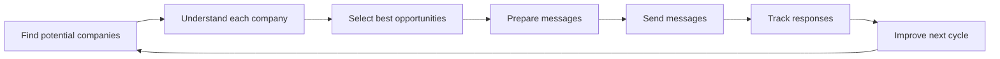

# Business Flow

For Non-Technical Readers:
- This is the full business cycle in plain language.
- Every cycle ends with a clear decision for the next cycle.
- Improvement is continuous, not one-time.

## Example Client Journey
1. Day 1: Build and review opportunity shortlist.
2. Day 2: Send personalized outreach.
3. Day 3: Review responses and engagement.
4. Day 4: Apply one improvement.
5. Day 5: Run the next improved cycle.
