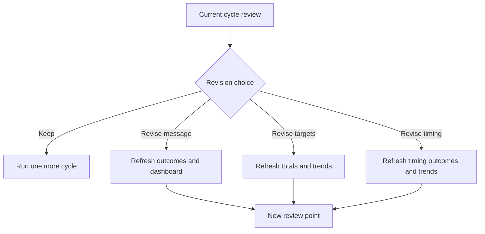

# Revision Map

For Non-Technical Readers:
- This is where you see exactly where revision is happening.
- The decision point is explicit, and each revision path shows what updates.

Current status: client acme-demo, run 9fe8c803ca0845f0.
Current trend: STABLE. Current health: MEDIUM (60).
Current watch flags: none.

## Locked Right Now (keep stable for fair comparison)
- Keep target people stable for one revision cycle
- Keep send timing stable for one revision cycle

## Open Right Now (safe to revise)
- Message wording
- Call-to-action phrasing

## Revision Impact Timeline
- Immediate: outcome view refreshes
- Same cycle: summary and dashboard refresh
- Next cycle: trend direction becomes clearer

