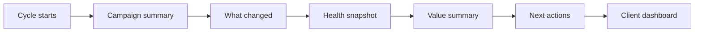

# What Gets Created

For Non-Technical Readers:
- You get a small set of decision-ready outputs.
- Each output answers a practical business question.
- You can operate daily by using just these outputs.

| What You Receive | When | Why It Matters | What To Do Next |
|---|---|---|---|
| Campaign activity summary | During and after run | Shows how many were contacted and key outcomes | Use this as your baseline before changing anything |
| What changed since last cycle | After run | Shows whether this cycle improved or declined | Decide if you keep current approach or revise one part |
| Campaign health snapshot | After run | Quick signal of how healthy this cycle is | Prioritize fixes if health is weak |
| Value summary | After run | Explains results in plain language | Share this in your update message |
| Next actions list | After run | Shows what to do next in priority order | Work top-down and close the highest-impact action first |
| Client-ready dashboard | After run | A simple page to present campaign results | Use this in client check-ins |
| 24 additional support files | After run | Background files kept by the system; you usually do not need to open them | No action needed unless troubleshooting |

