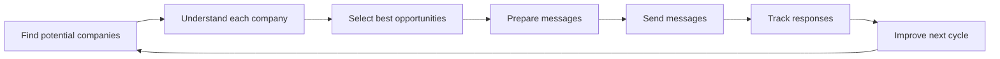

# What Happens

For Non-Technical Readers:
- This is the plain-language real-life story of each cycle.
- You are always choosing direction; the system handles repetition.
- At the end of each cycle, you get clear next actions.

Current example: client acme-demo, run 9fe8c803ca0845f0.
Last run snapshot: 0 sent, 0 replies, 0 qualified, reply rate 0.0000.
System activity this cycle: 13 internal background tasks completed to produce your outputs.

## Step-by-Step Story
### 1. Finding potential clients
The system gathers companies that may be a fit for your offer.
Output: a list of possible companies to contact.

### 2. Understanding each company
The system builds short context so outreach can be relevant.
Output: a simple profile for each company.

### 3. Selecting the best opportunities
Weak-fit companies are removed.
Output: a shortlist of stronger opportunities.

### 4. Preparing personalized messages
Messages are adapted to each company's likely needs.
Output: ready-to-send messages.

### 5. Sending the messages
Messages are sent gradually, not all at once.
Output: delivered outreach.

### 6. Watching for replies
Responses are tracked clearly.
Output: a response and engagement view.

### 7. Improving the next round
What worked is kept, what failed is revised.
Output: improved next cycle.
